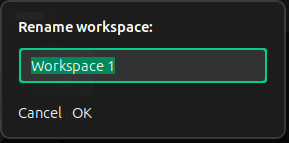

# Gnome Workspace Titles



## Install & Test Locally

1. Install the extension

```bash
mkdir -p ~/.local/share/gnome-shell/extensions/gnome-workspace-titles@MahdadGhasemian.github.io
cp -r src/* ~/.local/share/gnome-shell/extensions/gnome-workspace-titles@MahdadGhasemian.github.io/
```

2. Reload GNOME Shell:

- Press Alt + F2, type r, and press Enter.
- Or log out and back in.

3. Enable the extension

```bash
sudo apt install gnome-shell-extension-manager

gnome-extensions enable gnome-workspace-titles@MahdadGhasemian.github.io
```

4. Debug

```bash
journalctl -f -o cat /usr/bin/gnome-shell
journalctl -f -o cat /usr/bin/gnome-shell | grep gnome-workspace-titles
journalctl -f -o cat /usr/bin/gnome-shell | grep GnomeWorkspaceTitlesExtension
```

## Publish to GNOME Extensions

```bash
cd src && \
glib-compile-schemas schemas/ && \
zip -r ../output/gnome-workspace-titles.zip * && \
cd .. && \
gnome-extensions install output/gnome-workspace-titles.zip --force
```

🔗 [Upload to GNOME Extensions](https://extensions.gnome.org/upload/)

## Installing extension locally

1. Install via its zip file

```bash
gnome-extensions install output/gnome-workspace-titles.zip
```

2. Reload GNOME Shell:

- Press Alt + F2, type r, and press Enter.

3. Enable it:

```bash
gnome-extensions enable gnome-workspace-titles@MahdadGhasemian.github.io
```